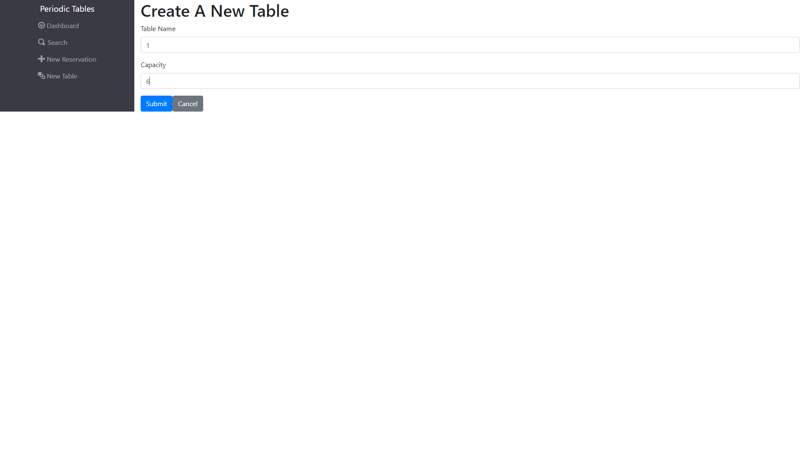
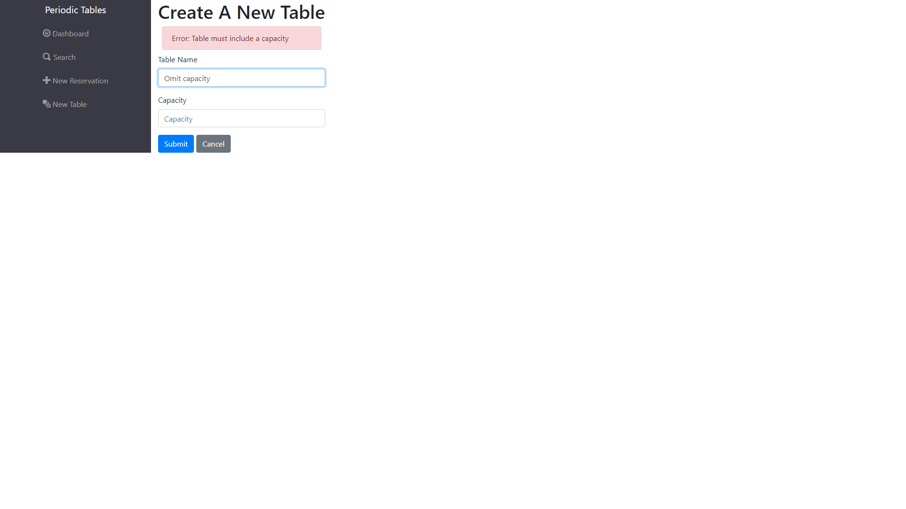
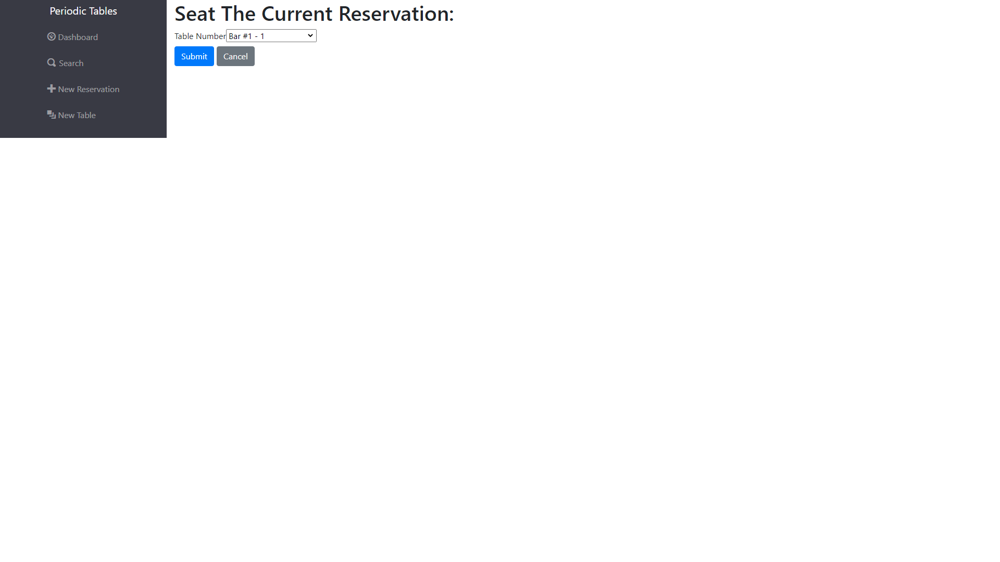
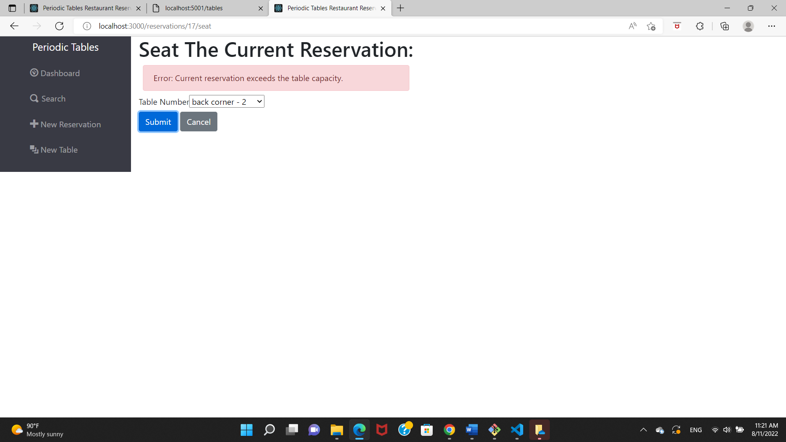

# Thinkful Capstone: Restaurant Reservation System

Deployed App Here: https://frontend-rcj3.onrender.com/dashboard

Full-Stack App Using the following:
- HTML
- CSS/BootStrap
- JAVASCript/JSX
- React.js
- Express.js
- PostgreSQL
- Knex.js

## Functionallity:
This restaurant App allows a user to easily create a new reservation for the restaurant, as well as allowing a restauarnt associate to manage current reservations, from accessing a list of the reservations per date, seating current reservations at available tables, and updating a reservation's information.

## API Endpoints:

| URL | Request Method | Description | Page |
| --- | -------------- | ---------------------------------------------------- | ----- |
|/reservations?date=YYYY-MM-DD | GET | Accesses and displays the reservations information based on a particular date query | Dashboard |
| /reservations?mobile_number=555-555-5555 | GET | Locates and displays all reservations based on the associated phone number | Search |
| /reservations | POST | Creates a new Reservation | New Reservation |
| /reservations/:reservationId | GET | Accesses and displays a particular reservation based on the reservation Id | Backend |
| /reservations/:reservationId/status | GET | Accesses a reservations status (booked, seated, cancelled) | Dashboard, Search |
| /tables | GET | Accesses and displays the tables information | Dashboard, Seats |
| /tables | POST | Creates a new table | New Table |
| /tables/:tableId/seat | PUT | Seats a reservation at a table by updating the reservation Id column in the tables API | Seats |
| /tables/:tableId/seat | DELETE | Finishes a table so it can be reseated | Dashboard |

## Screen Shots

Dashboard:

- Displays a menu to access the various pages.
- Displays a list of reservations together with buttons for seating a reservation at a particular table, editing a reservation's information, and cancelling a reservation.
- The default page uses the current date to query the reservations list for the current date.
- Three buttons on the bottom of the page toggle the reservations listed based on current, previous, and past dates.
- Displays a list of tables and pertinent information, such as a table's capacity, whether it is available, and which reservation may be occuping it, as well as a finish button to clear a table and indicate that it has become available.

  

Search:

- Allows a user to search for reservations based on the phone number associated with the reservation.
- Can search based on a partial number.
- If there is no match then it displays a "no match" message.
- Contains a submit button and a cancel button which goes back to the previous page.

New Reservation:

- Creates a new reservation.
- Contains a submit button and a cancel button which goes back to the previous page.
- Uses extensive validation to ensure the various inputs contain valid information.

New Table:

- Creates a new table.
- Uses validation to ensure the inputs contain valid information.

Seats:

- Allows the user to asign a reservation to an available table from the dropdown menu.
- Contains validation to ensure that the party size does not exceed the table capacity.
- Contains a seat button and a cancel button which goes back to the previous page.

## Technology:

This App uses JavaScript, HTML, CSS, and BootStrap CSS for the frontend UI, including BootStrap's built-in flex components for responsive design and responsive breakpoints. The App uses React.js as the frontend framework, and React Router for the frontend routing.
The backend of this App uses Express.js for easy routing, postgreSQL for creating and maintaining the App database, and Knex.js for querying the database.
The backend of this App handles the API requests and employs RESTful API conventions for DRY (don't repeat yourself) code and orginization by splitting the API handlers into seperate controller, router, and service files. The controller files handle validation and web-request methods, the router files handle the backend routes and allowed requests, and the service files handle the knex.js queries.

## Installation: 

1. Fork and clone this repository.
1. Update the `./back-end/.env` file with the connection URL's to your ElephantSQL database instance.
1. You should not need to make changes to the `./front-end/.env` file unless you want to connect to a backend at a location other than `http://localhost:5001`.
1. Run `npm install` to install project dependencies.
1. Run `npm run start:dev` to start your server in development mode.
1. Enjoy your journey!!

If you have trouble getting the server to run, reach out for assistance.
