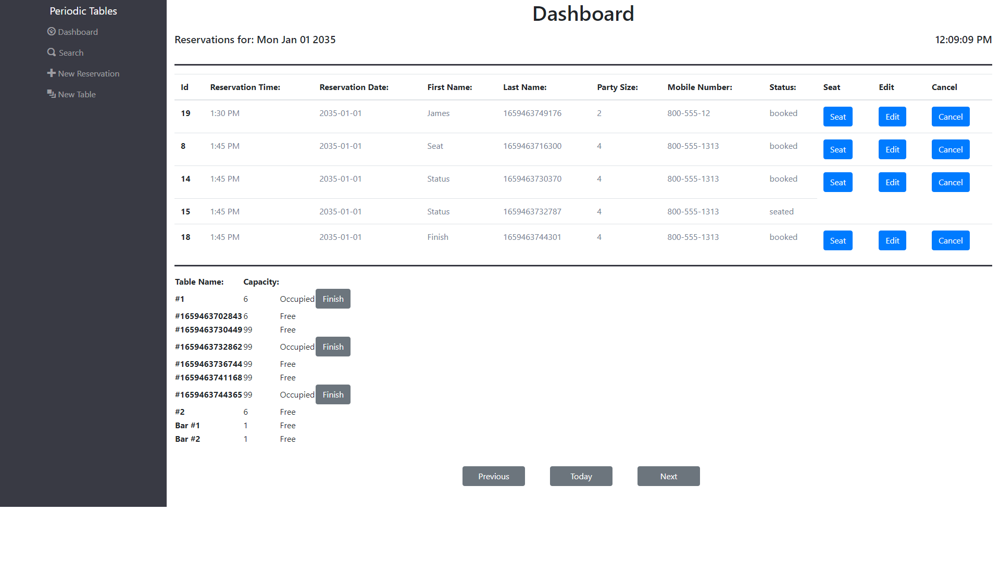
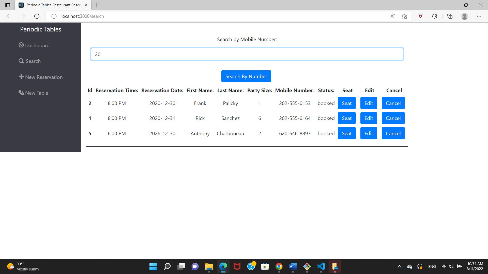
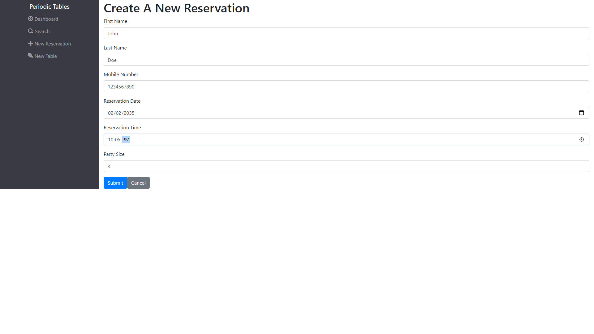
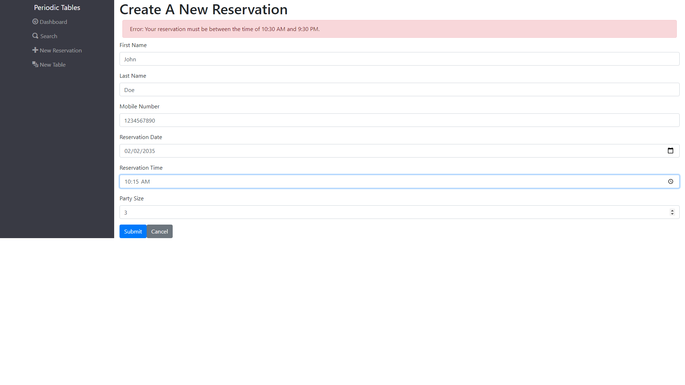

# Thinkful Final Capstone Project: Restaurant Reservation System

Deployed App Here: https://final-caps-22-client.herokuapp.com/dashboard

Full-Stack App Using the following:
- HTML
- CSS/BootStrap
- JAVASCript/JSX
- React.js
- Express.js
- PostgreSQL
- Knex.js

## API Endpoints:

| URL | Request Method | Description | Page |
| --- | -------------- | ---------------------------------------------------- | ----- |
|/reservations?date=YYYY-MM-DD | GET | Accesses and displays the reservations information based on a particular date query | Dashboard |
| /reservations?mobile_number=555-555-5555 | GET | Locates and displays all reservations based on the associated phone number | Search |
| /reservations | POST | Creates a new Reservation | New Reservation |
| /reservations/:reservationId | GET | Accesses and displays a particular reservation based on the reservation Id | Dashboard |
| /reservations/:reservationId/status | GET | Accesses a reservations status (booked, seated, cancelled) | Dashboard, Search |
| /tables | GET | Accesses and displays the tables information | Dashboard |
| /tables | POST | Creates a new table | New Table |
| /tables/:tableId/seat | PUT | Seats a reservation at a table by updating the reservation Id column in the tables API | Seats |
| /tables/:tableId/seat | DELETE | Finishes a table so it can be reseated | Dashboard |

## Screen Shots

Dashboard:

- Displays a menu to access the various pages.
- Displays a list of reservations together with buttons for seating a reservation at a particular table, editing a reservations information, and cancelling a reservation.
- The default page uses the current date to query the reservations list for the current date
- Three buttons on the bottom of the page toggle the reservations listed based on current, previous, and past dates.
- Displays a list of tables and pertinent information, such as a table's capacity, whether it is available, and which reservation may be occuping it, as well as a finish button to clear a table and indicate that it has become available.
 

  

Search:

- Allows a user to search for reservations based on the phone number associated with the reservation
- Can search based on part of anumber
- If there is no match then it displays a No match message
- Contains a submit button and a cancel button which goes back to the previous page

New Reservation:

- Creates a new reservation
- Contains a submit button and a cancel button which goes back to the previous page
- Uses extensive validation to ensure the various inputs contain valid information

